# Auto Release Note Generation

[](https://www.python.org/downloads/) [](https://opensource.org/licenses/MIT) [](https://github.com/astral-sh/ruff) [](https://github.com/astral-sh/uv) [](https://github.com/pydantic/pydantic) [](https://github.com/python/mypy) [](https://github.com/pytest-dev/pytest) [](https://git-scm.com/)

An AI-powered tool for automatically generating persona-specific release notes from Git repository history.

## Features

- **Multi-Persona Support** - Generate tailored release notes for developers, customers, and support teams
- **AI-Powered Summarization** - Intelligent content generation using structured prompts and validation
- **Git Integration** - Deep analysis of commit history, file changes, and merge patterns
- **Type-Safe Architecture** - Built with Pydantic models for robust data validation
- **Multiple Output Formats** - Export to Markdown, JSON, or custom templates
- **Extensible Design** - Plugin-ready architecture for custom personas and prompts

## Project Status

**Early Development** - Core architecture defined, implementation in progress.

**Current status:**
- ✅ System design and development roadmap complete
- 🔄 Data models and Git integration (Phase 1)
- ❌ AI summarization and multi-persona support (Phase 2+)

See our [Dev Plan](docs/dev_plan.md) for detailed progress tracking.

## Installation

### Prerequisites

- Python 3.10 or higher
- [uv](https://docs.astral.sh/uv/getting-started/installation/) - Fast Python package manager
- Git (version 2.0 or higher recommended)

### Development Setup

```bash
# Clone the repository
git clone https://github.com/AIWorldTakeover/auto-release-note-generation.git
cd auto-release-note-generation

# Install dependencies and create virtual environment
uv sync

# Verify installation
uv run pytest
uv run ruff check src/
uv run mypy src/
```

### Usage

> **Note**: The CLI is not yet implemented. This section will be updated as development progresses.

```bash
# Generate release notes between two Git refs
uv run auto-release-notes v1.0.0 v1.1.0

# Generate persona-specific notes
uv run auto-release-notes v1.0.0 v1.1.0 --persona customer

# Export to different formats
uv run auto-release-notes v1.0.0 v1.1.0 --format json --output release-v1.1.0.json
```

## Documentation

| Document | Purpose |
|----------|---------|
| [System Design](docs/system_design.md) | Architecture vision and design principles |
| [Implementation Roadmap](docs/dev_plan.md) | Development phases and milestones |

## Architecture

The system processes Git data through three hierarchical levels:

1. **Commit Level** - Individual Git commits with file changes and metadata
2. **Change Level** - Logical groupings of commits (features, bug fixes, etc.)
3. **Release Level** - Complete release bundles with high-level summaries

### Data Flow

```mermaid
flowchart LR
  %% Input & Configuration
  subgraph INPUT["🔧 Input"]
    A["CLI Input:<br/>start, end,<br/>persona, flags"]
    P["PromptProvider<br/>loads templates<br/>by persona"]
  end

  %% Commit Level Processing
  subgraph COMMIT["💬 Commit Level"]
    subgraph COMMIT_DATA["📊 Data Processing"]
      B["Extractor"]
      C["Raw Commits"]
    end
    subgraph COMMIT_AI["🤖 AI Summarization"]
      D["CommitSummarizer<br/>+prompts"]
      E["Commits w/<br/>AI summaries"]
    end
  end

  %% Change Level Processing
  subgraph CHANGE["🔄 Change Level"]
    subgraph CHANGE_DATA["📊 Data Processing"]
      F["Grouper"]
      G["Changes"]
    end
    subgraph CHANGE_AI["🤖 AI Summarization"]
      H["ChangeSummarizer<br/>+prompts"]
      I["Changes w/<br/>AI summaries"]
    end
  end

  %% Release Level Processing
  subgraph RELEASE["📦 Release Level"]
    subgraph RELEASE_DATA["📊 Data Processing"]
      J["Assembler"]
      K["Release Bundle"]
    end
    subgraph RELEASE_AI["🤖 AI Summarization"]
      L["ReleaseSummarizer<br/>+prompts"]
      M["Final Release<br/>w/ AI summary"]
    end
  end

  subgraph OUTPUT["📄 Output"]
    N["File I/O"]
    O["Release Notes<br/>.md/.json"]
  end

  %% Flow connections
  A --> B
  A -.-> P
  P -.-> D
  P -.-> H
  P -.-> L
  
  %% Internal flows
  B --> C
  C --> D
  D --> E
  E --> F
  F --> G
  G --> H
  H --> I
  I --> J
  J --> K
  K --> L
  L --> M
  M --> N
  N --> O

  %% Styling
  classDef inputStyle fill:#f1f8e9,stroke:#2e7d32,stroke-width:2px
  classDef levelStyle fill:#ffffff,stroke:#66bb6a,stroke-width:2px
  classDef outputStyle fill:#f1f8e9,stroke:#2e7d32,stroke-width:2px
  classDef dataStyle fill:#f3f4f6,stroke:#9ca3af,stroke-width:1px
  classDef aiStyle fill:#e8f5e9,stroke:#4caf50,stroke-width:1px

  class INPUT inputStyle
  class COMMIT,CHANGE,RELEASE levelStyle
  class OUTPUT outputStyle
  class COMMIT_DATA,CHANGE_DATA,RELEASE_DATA dataStyle
  class COMMIT_AI,CHANGE_AI,RELEASE_AI aiStyle
```



### Supported Personas

| Persona | Focus | Content |
|---------|--------|---------|
| **Developers** | Technical details | Breaking changes, migration guides, API changes |
| **Customers** | Business impact | New features, user benefits, bug fixes |
| **Support Teams** | Issue resolution | Known problems, troubleshooting tips, configuration changes |

## Development

### Project Structure

```bash
auto-release-note-generation/
├── prompts/                  # Persona-defined prompt templates (persona/level hierarchy)
│   ├── base/                 # Default prompts + persona metadata
│   │   ├── commit.md
│   │   ├── change.md
│   │   ├── release.md
│   │   └── user.md           # persona description & skillset
│   ├── customer/             # Overrides and metadata for “customer” persona
│   └── support/              # Overrides and metadata for “support” persona
├── src/
│   └── auto_release_note_generation/
│       ├── ai_models/        # LLM configuration, PromptProvider abstraction
│       ├── data_models/      # Pydantic schemas for Commit, Change, Release + summaries
│       ├── core/             # Pipeline steps (extractor, summarizers, assembler, orchestrator)
│       ├── io/               # Git operations & file I/O
│       └── cli.py            # Command-line interface entry point
├── tests/                    # Unit tests mirroring src structure
├── docs/                     # Supporting documentation (architecture, usage)
├── pyproject.toml            # Project metadata and dependencies
├── README.md                 # High-level overview and quickstart
└── .gitignore                # Exclude build artifacts and secrets
```


### Development Workflow

```bash
# Run the full development workflow
uv run ruff format src/ tests/       # Format code
uv run ruff check src/ tests/        # Lint code
uv run mypy src/                     # Type check
uv run pytest                        # Run tests
uv run pytest --cov                  # Run tests with coverage
```

### Code Quality

- **Formatting**: Ruff with default settings
- **Linting**: Comprehensive rule set including security checks
- **Type Checking**: MyPy in strict mode
- **Testing**: Pytest with 80%+ coverage requirement
- **Documentation**: Google-style docstrings

## Contributing

Contributions are welcome! This project is in early development with many opportunities to make an impact.

### Current Priorities

1. **Data Models** - Implement Pydantic schemas for Git data structures
2. **Git Integration** - Build GitWrapper for repository analysis
3. **Basic CLI** - Create command-line interface foundation
4. **Test Infrastructure** - Establish testing patterns and fixtures

### Getting Started

1. Check the [Implementation Roadmap](docs/dev_plan.md) for current priorities
2. Fork the repository and create a feature branch
3. Follow the development workflow and code quality standards
4. Submit a pull request with a clear description

### Development Setup

```bash
# Fork and clone your fork
git clone https://github.com/yourusername/auto-release-note-generation.git
cd auto-release-note-generation

# Set up development environment
uv sync

# Install pre-commit hooks (optional)
uv run pre-commit install
```

## License

This project is licensed under the [MIT License](LICENSE).

## Acknowledgments

- [PydanticAI](https://github.com/pydantic/pydantic-ai) for structured AI integration
- [uv](https://github.com/astral-sh/uv) for fast Python package management
- [Ruff](https://github.com/astral-sh/ruff) for Python linting and formatting
