# Auto Release Note Generation: System Design

This document captures the vision, design principles, and high-level architecture for the automated release note generator. It serves as the stable reference for what we're building and why.

---

## Problem Statement

Development teams need to generate clear, accurate release notes that communicate changes to different audiences (developers, customers, support teams). Manual release note creation is:

- **Time-consuming**: Developers spend significant time writing and formatting release notes
- **Inconsistent**: Different team members write in different styles and levels of detail
- **Error-prone**: Important changes get missed or misrepresented
- **Audience-blind**: One-size-fits-all notes don't serve different stakeholder needs

**Goal**: Automate the generation of persona-specific release notes from Git history using AI to improve quality, consistency, and development velocity.

---

## Design Principles

* **Modularity**: Each component has a single responsibility, enabling independent development and testing
* **Type-Safe Validation**: Use Pydantic models to enforce data contracts for both raw inputs and AI-generated outputs
* **Configurability**: Support multiple user personas and summarization levels without changing core code
* **Extensibility**: Allow future enhancements via well-defined abstractions and interfaces
* **Separation of Concerns**: Isolate I/O, business logic, AI interactions, and data modeling

**Rationale**: By adhering to these principles, the system remains maintainable, testable, and adaptable as requirements evolve.

---

## System Architecture

### Core Data Flow

```mermaid
flowchart LR
  %% Input & Configuration
  subgraph INPUT["🔧 Input"]
    A["CLI Input:<br/>start, end,<br/>persona, flags"]
    P["PromptProvider<br/>loads templates<br/>by persona"]
  end

  %% Commit Level Processing
  subgraph COMMIT["💬 Commit Level"]
    subgraph COMMIT_DATA["📊 Data Processing"]
      B["Extractor"]
      C["Raw Commits"]
    end
    subgraph COMMIT_AI["🤖 AI Summarization"]
      D["CommitSummarizer<br/>+prompts"]
      E["Commits w/<br/>AI summaries"]
    end
  end

  %% Change Level Processing
  subgraph CHANGE["🔄 Change Level"]
    subgraph CHANGE_DATA["📊 Data Processing"]
      F["Grouper"]
      G["Changes"]
    end
    subgraph CHANGE_AI["🤖 AI Summarization"]
      H["ChangeSummarizer<br/>+prompts"]
      I["Changes w/<br/>AI summaries"]
    end
  end

  %% Release Level Processing
  subgraph RELEASE["📦 Release Level"]
    subgraph RELEASE_DATA["📊 Data Processing"]
      J["Assembler"]
      K["Release Bundle"]
    end
    subgraph RELEASE_AI["🤖 AI Summarization"]
      L["ReleaseSummarizer<br/>+prompts"]
      M["Final Release<br/>w/ AI summary"]
    end
  end

  subgraph OUTPUT["📄 Output"]
    N["File I/O"]
    O["Release Notes<br/>.md/.json"]
  end

  %% Flow connections
  A --> B
  A -.-> P
  P -.-> D
  P -.-> H
  P -.-> L
  
  %% Internal flows
  B --> C
  C --> D
  D --> E
  E --> F
  F --> G
  G --> H
  H --> I
  I --> J
  J --> K
  K --> L
  L --> M
  M --> N
  N --> O

  %% Styling
  classDef inputStyle fill:#f1f8e9,stroke:#2e7d32,stroke-width:2px
  classDef levelStyle fill:#ffffff,stroke:#66bb6a,stroke-width:2px
  classDef outputStyle fill:#f1f8e9,stroke:#2e7d32,stroke-width:2px
  classDef dataStyle fill:#f3f4f6,stroke:#9ca3af,stroke-width:1px
  classDef aiStyle fill:#e8f5e9,stroke:#4caf50,stroke-width:1px

  class INPUT inputStyle
  class COMMIT,CHANGE,RELEASE levelStyle
  class OUTPUT outputStyle
  class COMMIT_DATA,CHANGE_DATA,RELEASE_DATA dataStyle
  class COMMIT_AI,CHANGE_AI,RELEASE_AI aiStyle
```



The system processes Git data through three hierarchical levels:
1. **Commit Level**: Individual Git commits with file changes and metadata
2. **Change Level**: Logical groupings of commits (features, bug fixes, etc.)
3. **Release Level**: Complete release bundles with high-level summaries

### Component Responsibilities

#### Data Models Layer
- **GitContext**: Shared Git metadata (SHA, author, message, etc.)
- **Commit**: Individual commit with file changes and AI summary
- **Change**: Logical grouping of commits with aggregated metadata
- **Release**: Complete release with all changes and executive summary
- **AI Summaries**: Structured AI-generated content with confidence scores

#### Processing Pipeline
- **Extractor**: Converts Git log data into structured Commit objects
- **Summarizers**: Generate AI summaries at each level (commit, change, release)
- **Grouper**: Clusters commits into logical Change units
- **Assembler**: Aggregates Changes into Release bundles
- **Orchestrator**: Coordinates the entire pipeline

#### Infrastructure Layer
- **PromptProvider**: Abstract interface for loading persona-specific prompts
- **GitWrapper**: Encapsulates Git operations and data parsing
- **FileIO**: Handles output generation in multiple formats

### Key Interfaces

#### PromptProvider Interface
```python
def get_prompt(persona: str, level: str) -> str:
    """Load prompt template for given persona and summarization level"""
```

#### Pipeline Step Interface
```python
def process(input_data: T) -> U:
    """Transform input data to output data with error handling"""
```

### Data Contracts

#### Core Data Structure
- **Commit**: Git metadata + file changes + optional AI summary
- **Change**: Git metadata + commit list + aggregated changes + optional AI summary  
- **Release**: Version info + change list + optional AI summary

#### AI Summary Structure
- **Base**: Summary text + confidence score + generation timestamp
- **Commit**: Base + impact level + categories
- **Change**: Base + user impact + breaking changes + component areas
- **Release**: Base + highlights + migration notes

---

## Extension Points

### Prompt Management
- **Current**: File-based prompts with persona hierarchy
- **Future**: Database-backed prompts with versioning and A/B testing
- **Interface**: PromptProvider abstraction enables seamless migration

### AI Integration
- **Current**: PydanticAI with structured output validation
- **Future**: Multiple model support, RAG integration, caching
- **Interface**: Summarizer agents can be swapped without pipeline changes

### Output Formats
- **Current**: Markdown and JSON output
- **Future**: HTML, PDF, API integration, webhook notifications
- **Interface**: FileIO abstraction supports multiple output targets

### Data Processing
- **Current**: Sequential processing pipeline
- **Future**: Parallel processing, caching, incremental updates
- **Interface**: Pipeline steps are independent and can be parallelized

---

## Non-Functional Requirements

### Performance
- Handle repositories with 1000+ commits in reasonable time
- Support incremental processing for large release ranges
- Enable parallel AI summarization where possible

### Reliability
- Graceful degradation when AI services are unavailable
- Retry logic for transient failures
- Validation of AI outputs against expected schemas

### Usability
- Simple CLI interface with sensible defaults
- Clear error messages and debugging information
- Support for common Git workflows and branch strategies

### Maintainability
- Comprehensive test coverage with mocked external dependencies
- Clear separation between pure functions and side effects
- Extensive logging and observability hooks

---

*This design document provides the stable foundation for implementation decisions. Implementation details will evolve, but these core principles and interfaces should remain consistent.*
